# 🛍️ ProductStore

1. **Product app**
   - Created `products` app

   - Built `Product` model with fields:
     name, description, price, stock, image

   - Set up CRUD using generic views:
     ListView, DetailView, CreateView, UpdateView, DeleteView
   
   - Added product URLs to `urls.py`:
     /products/, /products/<id>/, /create/, /update/, /delete/

2. **Category app**
   - Created `categories` app

   - Built `Category` model with:
     name, description, image

   - Added category to Product:
     category = ForeignKey(Category, on_delete=CASCADE)

   - Updated product forms with category field

   - Set up category views with generics:
     CategoryListView, CategoryDetailView, CategoryCreateView...

   - Connected URLs:
     /categories/, /categories/<id>/, /create/...

3. **Finally**
   - Added user authentication
   - Styled with Tailwind CSS
   - Protected category operations

## 📍 Endpoints

### Products
- `GET /products/` - List all products
- `GET /products/<id>/` - View product details
- `GET /products/create/` - Show product creation form
- `POST /products/create/` - Create new product
- `GET /products/<id>/delete/` - Delete a product

### Categories
- `GET /categories/` - List all categories
- `GET /categories/<id>/` - View category details
- `GET /categories/create/` - Show category creation form
- `POST /categories/create/` - Create new category
- `GET /categories/<id>/delete/` - Delete a category

## � Screenshots

### Login
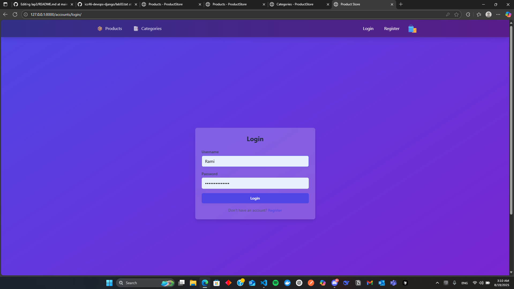

### Register
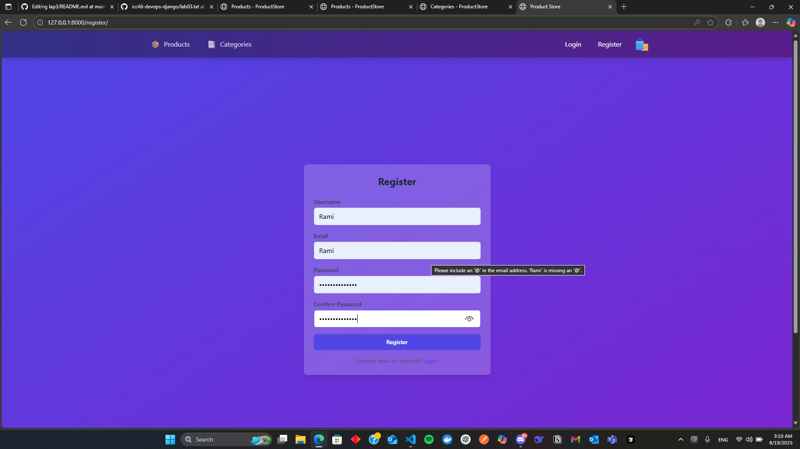

### Products page
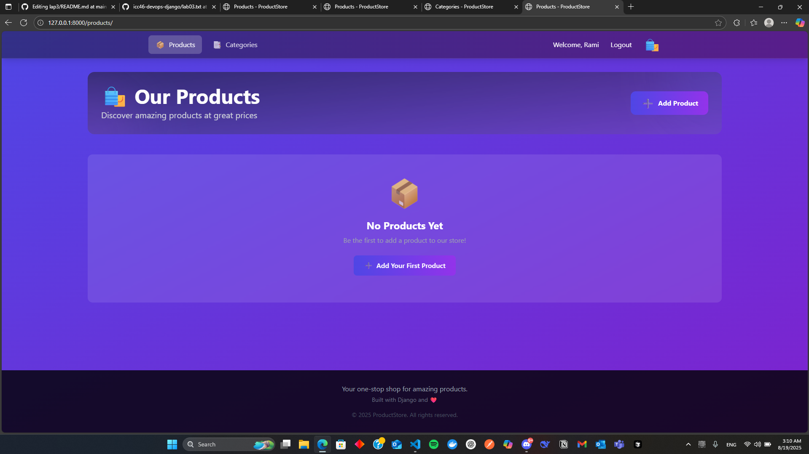

### Categories page
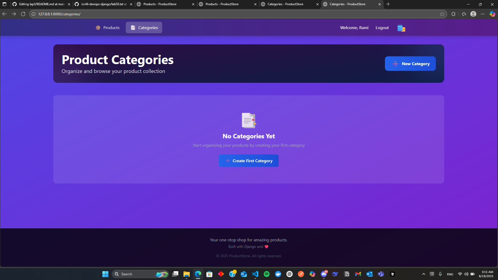

### Category creation
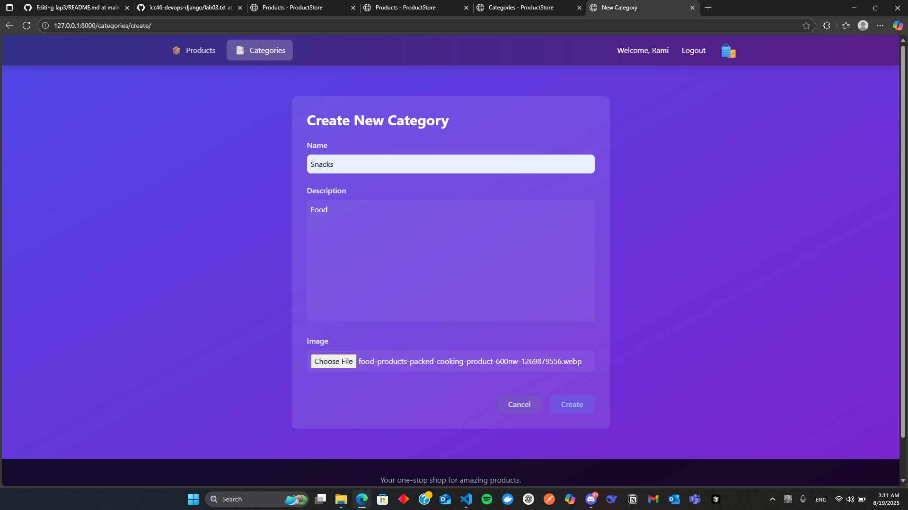

### Category page after adding
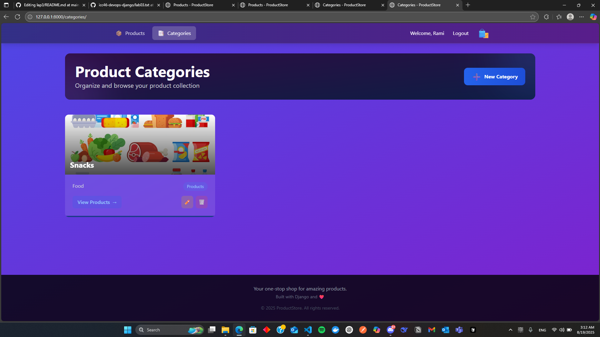

### Adding product
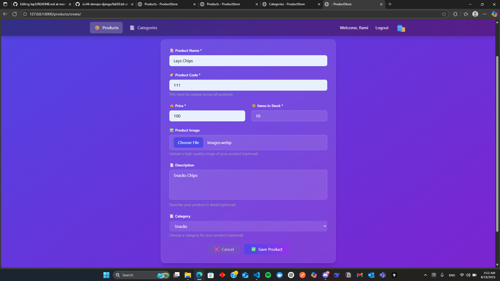

### After creation
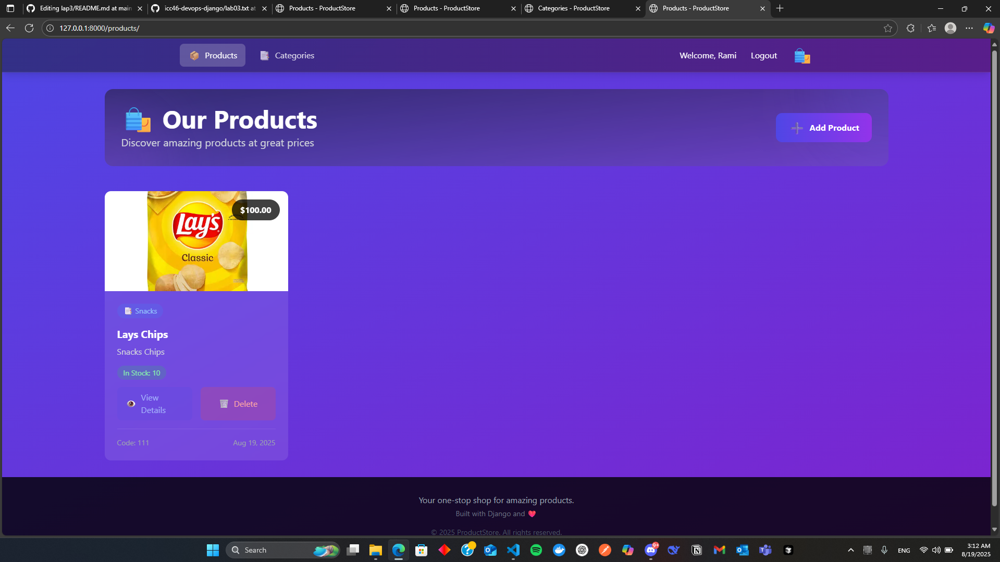

### Viewing details and edit or delete
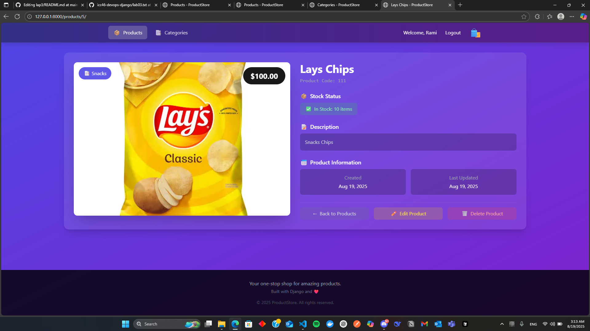

### Delete alert
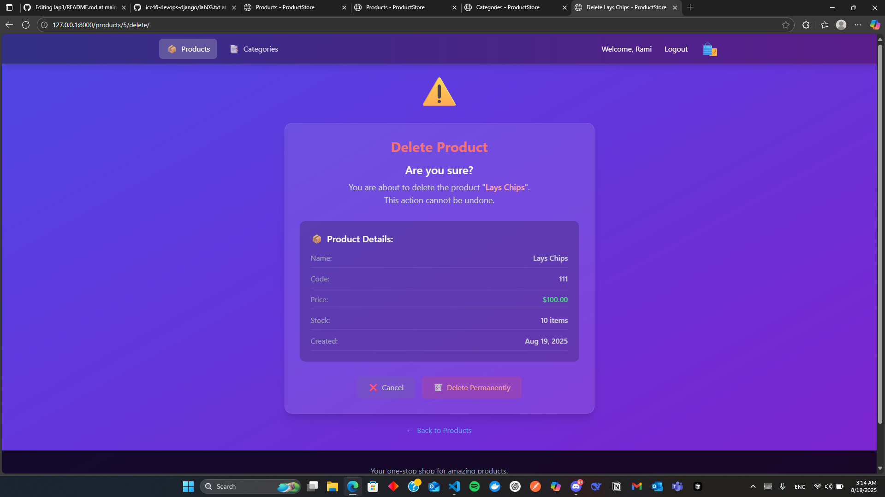

### Viewing products in specefic category
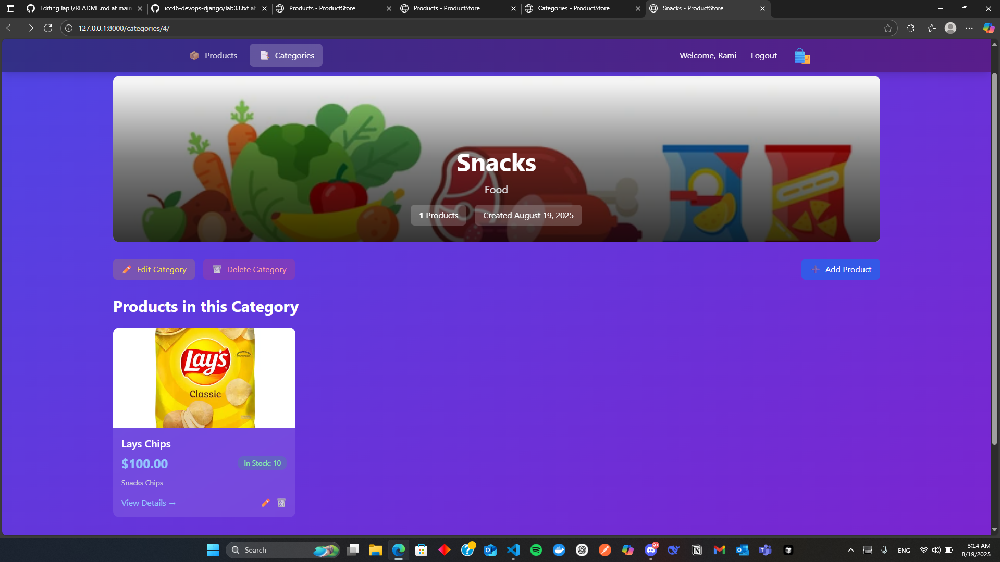

